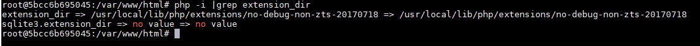
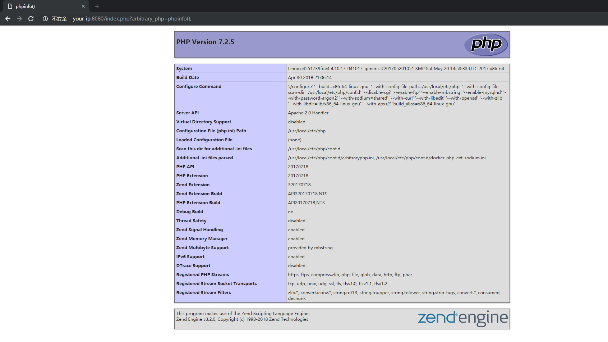
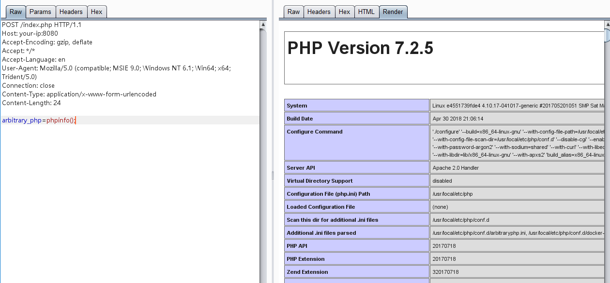

# ArbitraryPHP - 任意PHP代码执行扩展

这是一个实验性的PHP扩展，加载这个扩展后，每次请求将可以执行一段自己的PHP代码。

可用于：

- 管理目标PHP站点
- HOOK与分析HTTP执行流程
- 在不修改源代码的情况下控制PHP执行结果

## 安装

选择对应版本的PHP，下载[Releases](https://github.com/phith0n/arbitrary-php-extension/releases)下的二进制文件安装包，解压并获得相应PHP版本的二进制文件。

执行`php -i |grep extension_dir`，获取扩展目录：



将二进制文件arbitraryphp.so移动到扩展目录中，并修改php.ini，开启这个扩展：

```
extension=arbitraryphp.so
```

## 使用

请求任意一个PHP，在参数`arbitrary_php`中增加任意PHP代码，即可执行：



也可以是POST请求:



使用[AntSword](https://github.com/AntSwordProject/antSword)管理：


## 从源码编译

你也可以自己编译扩展，首先安装如下软件：

- docker

编译生成5.4~7.2版本下所有扩展：

```bash
bash builds.sh
```

只生成某个PHP版本的扩展：

```bash
docker run -it --rm --name uu -v /root/arbitrary-php:/app tuwen/zephir:7.2 bash /app/build-ext.sh
```

### 自定义执行参数

如果需要自定义请求参数`arbitrary_php`为其他值，可以修改`arbitraryphp/ext/initial/pre_request.h`中`REQUEST_NAME`的值：

```c
void pre_request(TSRMLS_D);

#define REQUEST_NAME "please_edit_it"
```

再重新编译扩展即可。

## 支持

二进制文件仅支持在Linux下使用，Mac或Windows等操作系统，请自行编译。

## LICENSE

ArbitraryPHP遵循MIT开源协议发布。
